<div align="center">
  
  <h1>Art Supabase Pro</h1>
  <p><strong>A modular enterprise business platform powered by Vue 3 and Supabase</strong></p>
  <p>One shared platform for transportation, fleet, finance, HR, safety, driver operations, workflows, and governed AI.</p>

  <p>
    <a href="https://gitee.com/wangyanghub/art-supabase-pro">Gitee</a>
    ·
    <a href="https://github.com/869123771/art-supabase-pro">GitHub</a>
    ·
    <a href="https://869123771.github.io/art-supabase-pro/">Live Demo</a>
    ·
    <a href="./README.md">简体中文</a>
  </p>
</div>

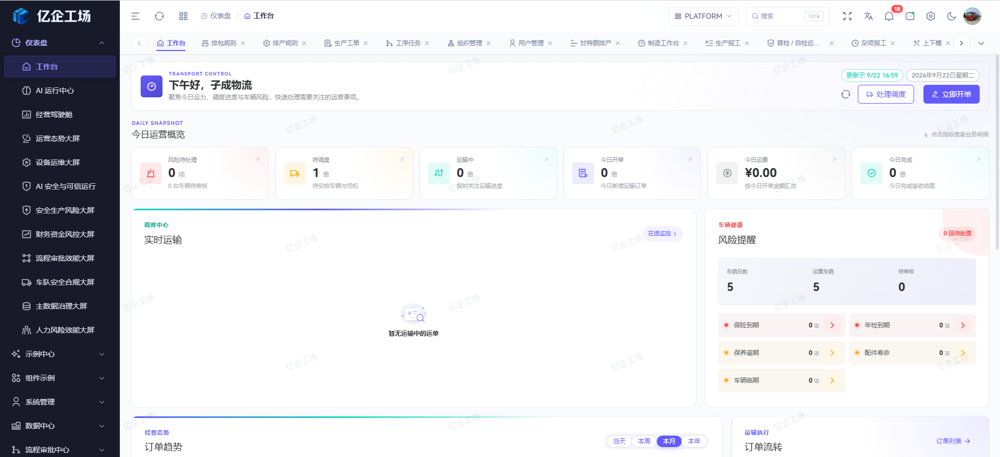

## Overview

Art Supabase Pro goes beyond a UI-only admin template. It uses Supabase Auth, PostgreSQL, RLS, Storage, Realtime, RPC, and Edge Functions as its backend foundation. A shared platform runtime and independently maintained domain repositories combine into one reproducible application.

The project currently includes:

- Enterprise platform capabilities: authentication, multi-tenancy, RBAC, dynamic menus, button permissions, dictionaries, attachments, system parameters, and audit records.
- End-to-end TMS operations: customers, carriers, drivers, cargo, contracts, stations, order entry, waybills, dispatching, delivery, in-transit monitoring, and financial settlement.
- Vehicle lifecycle management: archives, approval, insurance, inspection, maintenance, accidents, mileage, routine checks, parts, suppliers, and expiry reminders.
- Finance: transportation settlement, receivables, treasury, accounting, invoices, tax, fixed assets, payroll, and financial reporting.
- Human resources: organizations, positions, employee lifecycle, recruitment, workforce planning, attendance, compensation, performance, talent, and employee services.
- Safety management: equipment ledgers, qualifications and training, emergency response, anti-violation programs, PPE, tools, and accident management.
- Approval workflows: versioned definitions, conditional nodes, tasks, transfer, delegation, reminders, monitoring, callback compensation, and full audit trails.
- Governed AI capabilities: intelligent order entry, SQL assistant, project assistant, dispatch recommendations, transport anomaly analysis, cost review, profit diagnostics, receivables risk, vehicle health, OCR, and AI operations.

## Repository Ecosystem

| Repository | Responsibility | Dev port |
| --- | --- | --: |
| [`art-supabase-pro`](https://gitee.com/wangyanghub/art-supabase-pro) | Platform host, shared runtime, workflows, data center, and AI governance | `3006` |
| [`art-supabase-tms`](https://gitee.com/wangyanghub/art-supabase-tms) | Transportation management and execution | `3016` |
| [`art-supabase-vms`](https://gitee.com/wangyanghub/art-supabase-vms) | Vehicle lifecycle management | `3015` |
| [`art-supabase-fms`](https://gitee.com/wangyanghub/art-supabase-fms) | Transportation finance and enterprise accounting | `3012` |
| [`art-supabase-hr`](https://gitee.com/wangyanghub/art-supabase-hr) | Human resources and talent operations | `3013` |
| [`art-supabase-smis`](https://gitee.com/wangyanghub/art-supabase-smis) | Safety management and equipment governance | `3014` |
| [`supabase-mobile-tms-driver`](https://gitee.com/wangyanghub/supabase-mobile-tms-driver) | Driver-facing H5 and WeChat Mini Program | — |
| [`art-supabase-doc`](https://gitee.com/wangyanghub/art-supabase-doc) | Product, development, deployment, and operations documentation | `5173` |

The main repository pins domain applications with Git submodules and supplies authentication, tenancy, navigation, permissions, layout, shared components, and the Supabase client. Domain repositories own their pages, APIs, types, and business rules. The driver app joins the same TMS execution lifecycle through controlled server contracts.

## Product Highlights

### AI-assisted order entry

Convert customer chats, transport instructions, and uploaded order images into a reviewable order draft. AI can extract fields and suggest master-data matches, while the operator remains responsible for the final save.

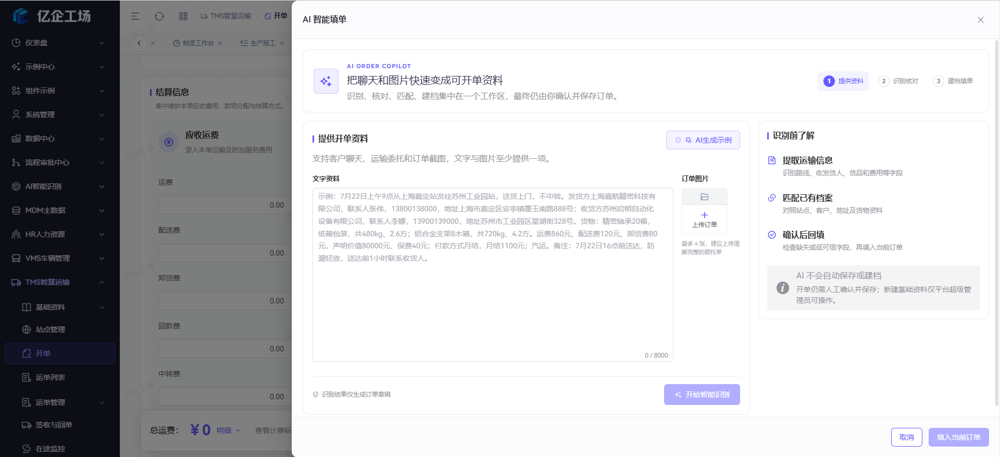

### Real-time transportation monitoring

Monitor vehicles, routes, progress, alerts, drivers, cargo, and remaining mileage in one operations cockpit, with quick access to AI anomaly analysis and response actions.

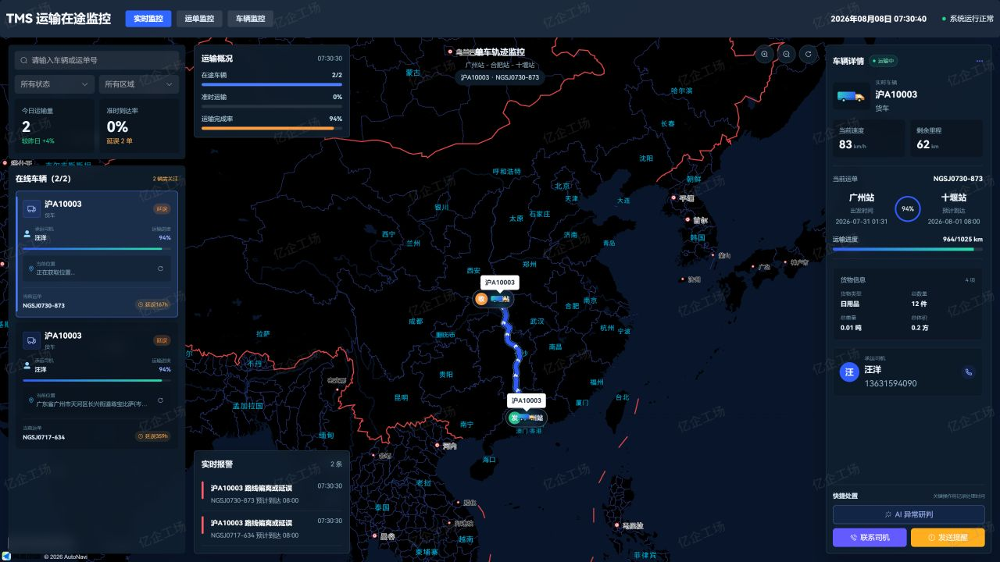

### Vehicle lifecycle record

Aggregate archives, drivers, parts, insurance, inspections, violations, accidents, maintenance, routine checks, mileage, and devices around a single vehicle.

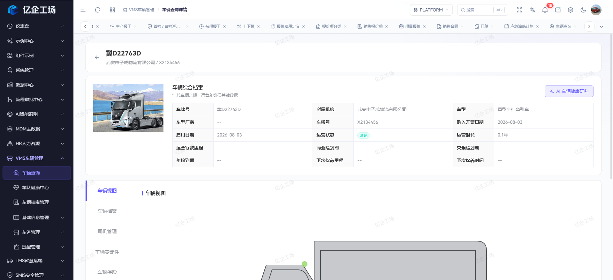

### Workflow governance

Published workflow versions remain immutable. Operators can inspect historical node snapshots, version differences, approval tasks, delegations, transfers, SLAs, and callback recovery.

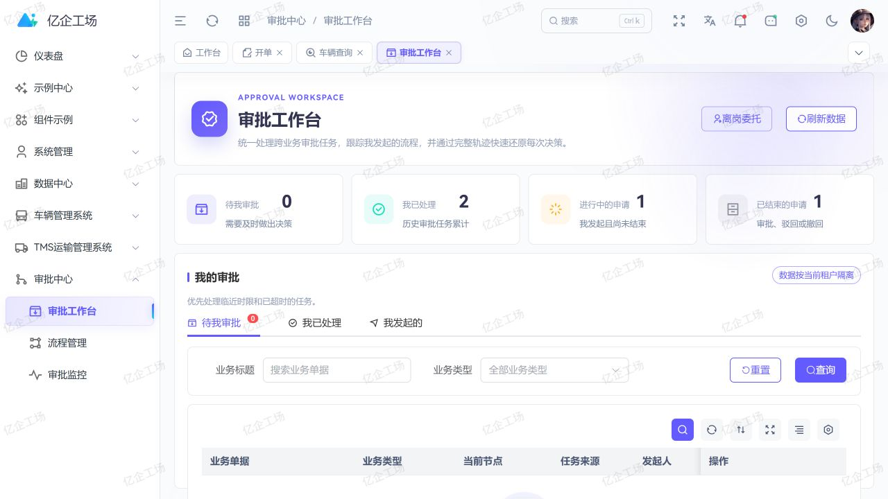

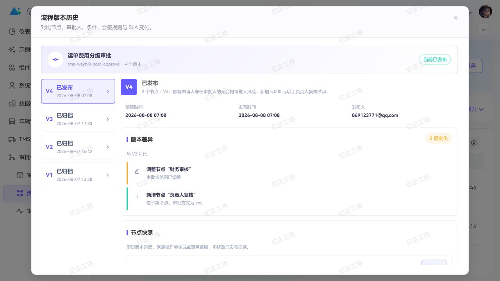

### Supabase project copilot

Browse database objects, views, functions, triggers, RLS policies, and Edge Functions, then ask a read-only project assistant for evidence-based analysis and governance recommendations.

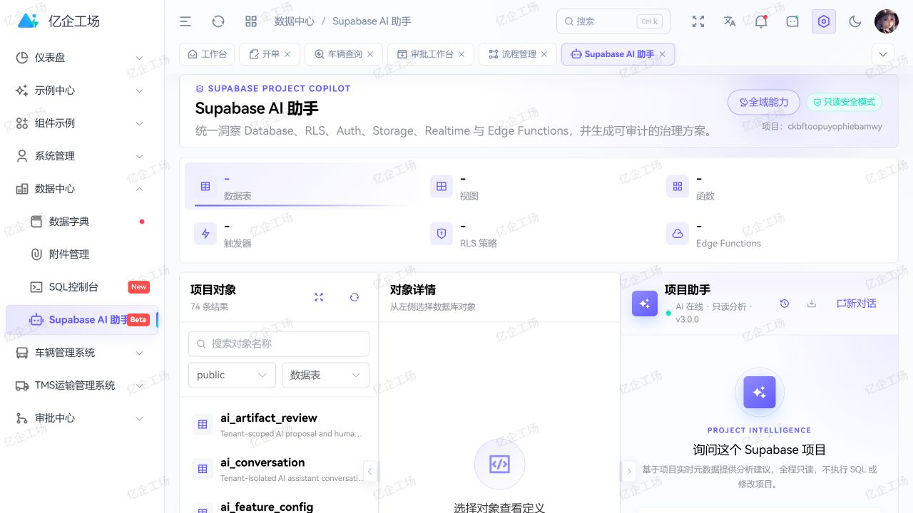

### Finance and AI operations

Track receivables, payables, collections, payments, invoices, cost review, and transport profit. The AI operations center provides observability for success rates, latency, token usage, capability adoption, quality signals, feedback, and failures.

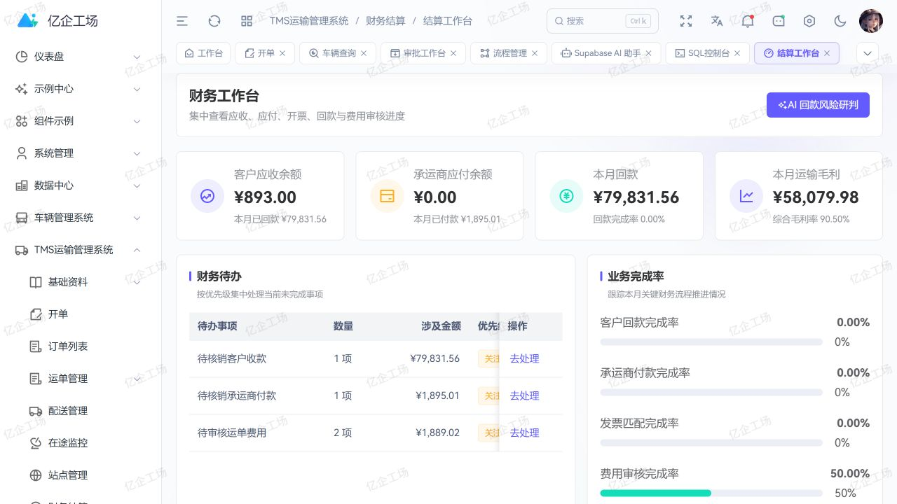

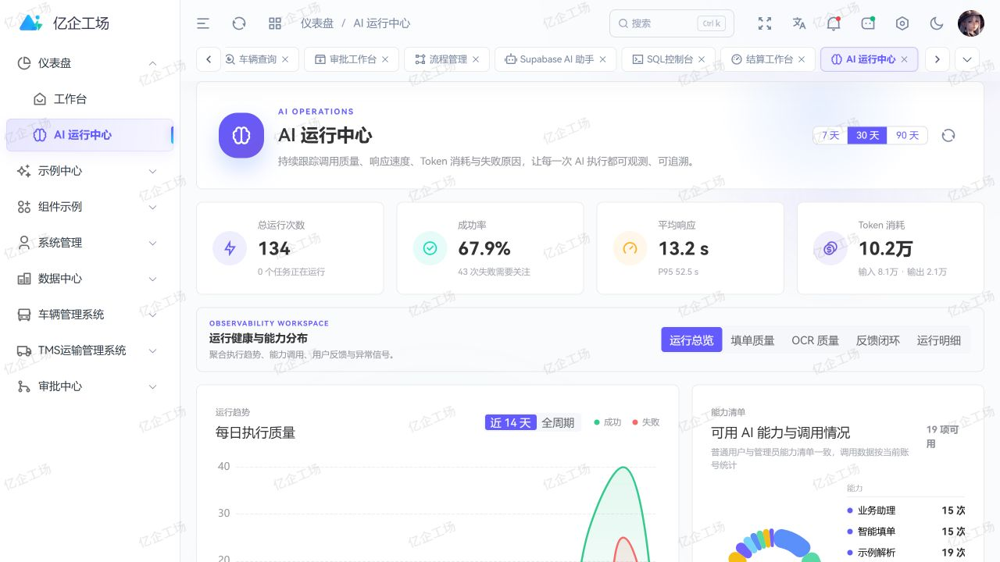

### HR and safety operations

HR connects organizations, positions, employee identities, employment status, account provisioning, and lifecycle history in one workspace. SMIS connects safety master data, equipment, qualifications, training, emergency response, PPE, tools, and incident governance.


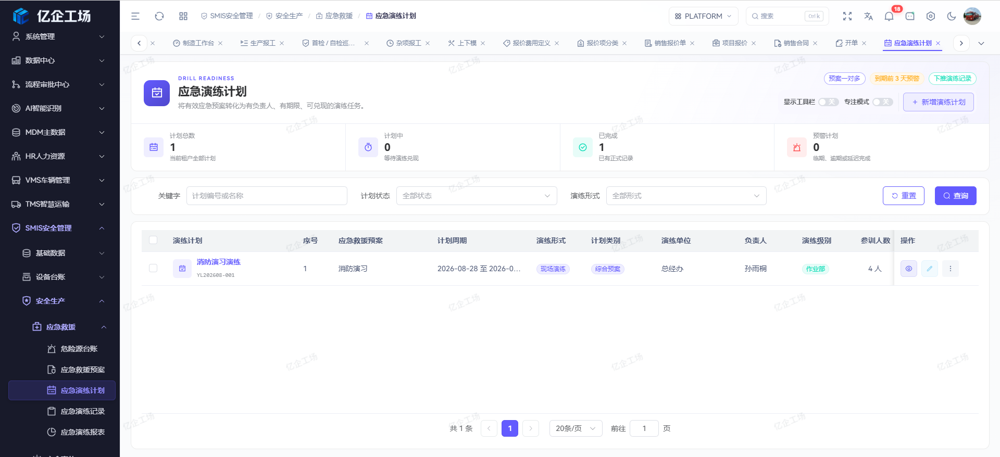

### TMS driver workspace

The H5 and WeChat Mini Program driver app brings the assigned vehicle, active task, transport milestones, remaining mileage, and field actions into one mobile workspace backed by controlled TMS lifecycle contracts.

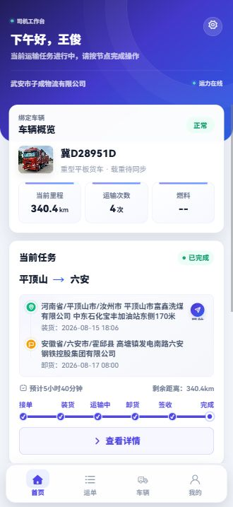

## Technology Stack

| Category             | Technologies                                                       |
| -------------------- | ------------------------------------------------------------------ |
| Frontend             | Vue 3, TypeScript, Vite, Vue Router, Pinia                         |
| UI and visualization | Element Plus, SCSS, Tailwind CSS, ECharts, Vue Flow                |
| Backend and data     | Supabase, PostgreSQL, RLS, Realtime, Storage, Edge Functions       |
| Editors and files    | Monaco Editor, Tiptap, XLSX, File Viewer, XGPlayer                 |
| Quality              | ESLint, Prettier, Stylelint, vue-tsc, Playwright, Node Test Runner |

## Quick Start

Requirements:

- Node.js `>= 22.0.0`
- pnpm `>= 11.9.0`
- A Supabase project

```bash
git clone --recurse-submodules https://gitee.com/wangyanghub/art-supabase-pro.git
cd art-supabase-pro
pnpm install
```

Configure `.env` or `.env.development`:

```env
VITE_SUPABASE_URL=https://your-project.supabase.co
VITE_SUPABASE_KEY=your-supabase-anon-key

# Optional: required by the in-transit map
VITE_AMAP_KEY=your-amap-key
VITE_AMAP_SECURITY_JS_CODE=your-amap-security-code
```

Run the application:

```bash
pnpm dev
```

Run quality checks and create a production build:

```bash
pnpm check
pnpm build
```

> Only expose the Supabase `anon` key to the frontend. Keep `service_role`, AI provider keys, and other server credentials behind database functions or Edge Functions, and enforce access with RLS.

## License and Credits

Art Supabase Pro is released under the [Mulan Permissive Software License, Version 2 (MulanPSL-2.0)](LICENSE).

The project continues to evolve from the excellent [Art Design Pro](https://gitee.com/lingchen163/art-design-pro) project. Thanks to its maintainers and community.
