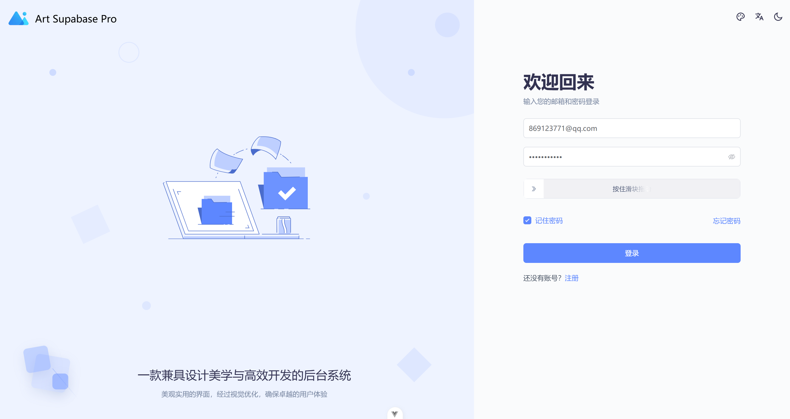
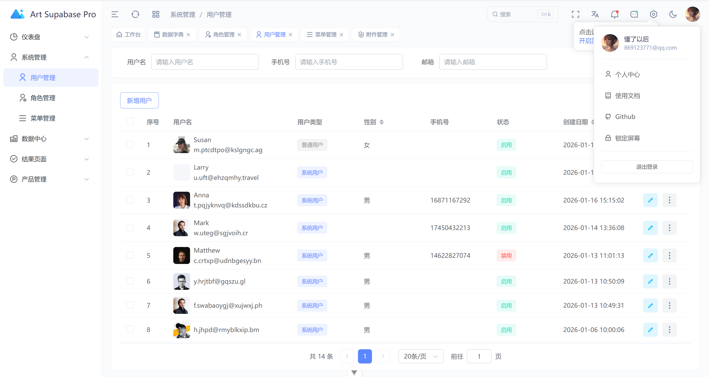
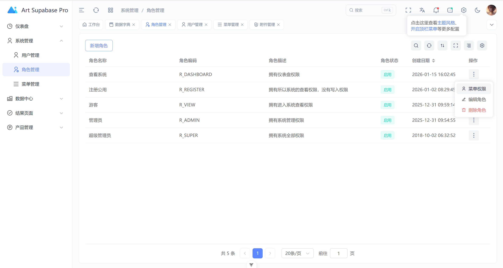
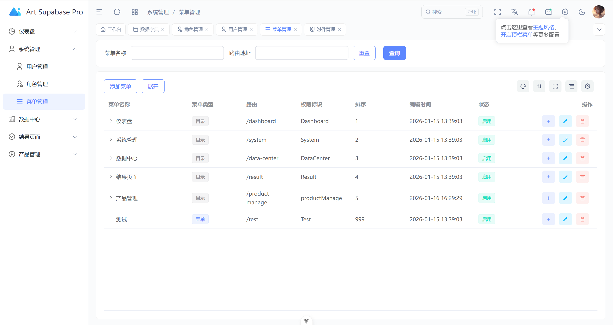
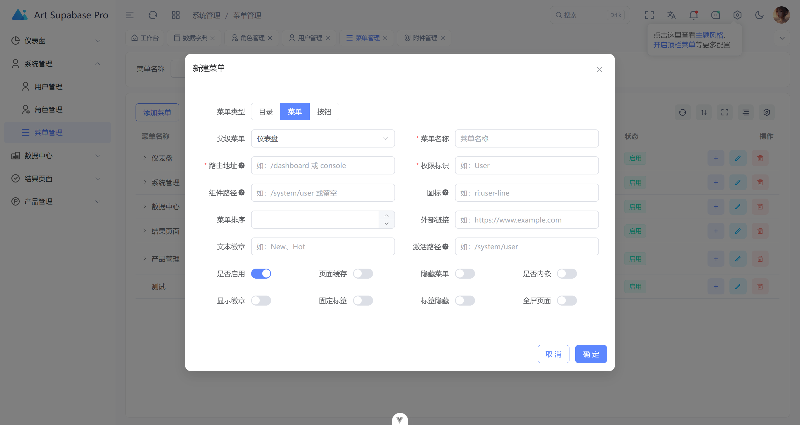
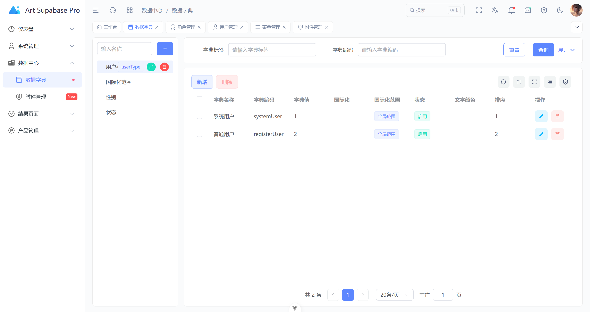
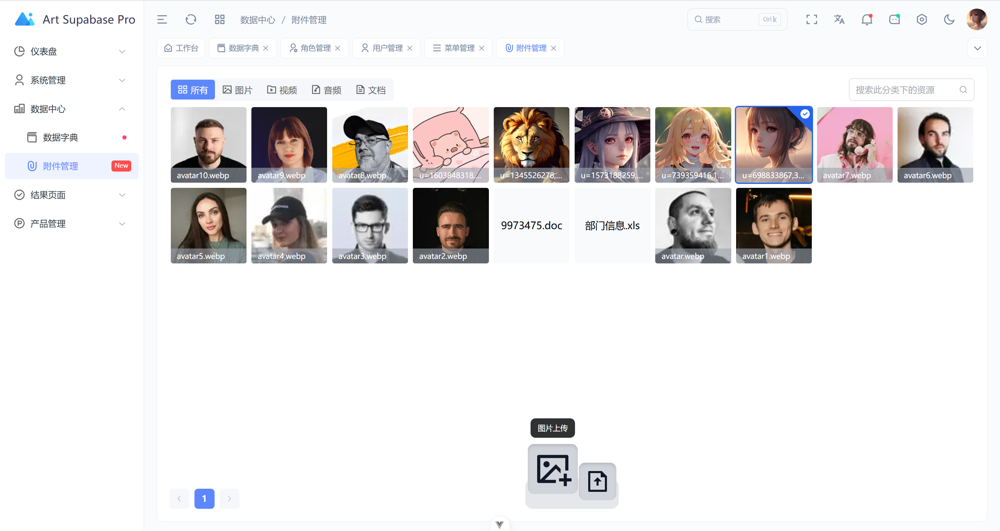

# Art Supabase Pro

Art Supabase Pro 是一个基于 **Vue 3**, **TypeScript**, **Element Plus** 和 **Supabase** 构建的现代化后台管理系统模板。它提供了丰富的功能组件、完善的权限控制以及开箱即用的系统管理模块，旨在帮助开发者快速构建高性能的企业级应用。

在线地址 [https://869123771.github.io/art-supabase-pro/](https://869123771.github.io/art-supabase-pro/)

## ✨ 功能特性

- **现代化的技术栈**：基于 Vue 3 + Vite + TypeScript + Pinia 构建。
- **后端即服务集成**：深度集成 Supabase，提供认证、数据库和实时订阅支持。
- **完善的用户体验**：
  - 🌗 支持亮色/暗色模式切换。
  - 🔒 支持锁屏、多级权限控制 (RBAC) 和 JWT 鉴权。
  - 🔍 全局搜索、工作标签页 (WorkTab) 导航。
  - 📱 响应式布局，适配移动端与桌面端。
- **丰富的组件库**：
  - 📊 集成 ECharts，支持多种图表类型（折线图、柱状图、K线图、雷达图等）。
  - 📋 智能表格组件，支持列配置、固定头、虚拟滚动。
  - 📝 动态表单组件，支持 Excel 导入导出。
  - 🖼️ 图片/视频处理组件。
- **i18n 国际化支持**：内置中文、英文语言包。
- **开发辅助**：
  - 🧹 自动化清理脚本 (clean-dev.ts)。
  - 📝 升级日志管理。
  - 🔧 强大的设置面板，可实时调整布局、颜色、导航等。


## 功能截图

### 1. 登录页面(用邮箱注册后即可登录)


### 2. 用户管理（做了用户隔离，用户只能看到自己的数据）


### 3. 用户管理新增


### 4. 角色管理（注册用户默认给了注册权限，可以查看所有菜单）


### 5. 菜单管理


### 6. 菜单管理新增


### 7. 数据字典


### 8. 资源管理



## 🛠️ 技术栈

- **构建工具**: Vite
- **框架**: Vue 3 (Composition API)
- **语言**: TypeScript
- **UI 组件库**: Element Plus
- **状态管理**: Pinia
- **路由**: Vue Router
- **图表**: Apache ECharts
- **后端服务**: Supabase
- **样式**: SCSS + Tailwind CSS
- **HTTP**: Axios
- **国际化**: Vue I18n

## 📂 项目结构

```
art-supbase-pro/
├── public/                 # 静态资源
├── src/
│   ├── api/                # API 接口定义 (对接 Supabase)
│   ├── assets/             # 图片、字体等静态资源
│   ├── components/         # 业务组件
│   │   └── core/           # 核心业务组件 (Charts, Forms, Layouts, Tables)
│   ├── config/             # 应用配置 (路由菜单、快捷入口、主题等)
│   ├── directives/         # 自定义指令 (Auth, Roles, Highlight)
│   ├── hooks/              # 组合式函数 (useTable, useAuth, useTheme)
│   ├── locales/            # 国际化语言包
│   ├── router/             # 路由配置与守卫
│   ├── store/              # Pinia 状态管理
│   ├── types/              # TypeScript 类型定义
│   ├── utils/              # 工具函数 (Http, Tree, Format, Storage)
│   ├── views/              # 页面视图
│   │   ├── auth/           # 登录、注册、找回密码
│   │   ├── dashboard/      # 控制台首页
│   │   ├── system/         # 系统管理 (用户、角色、菜单)
│   │   └── data-center/    # 数据中心 (字典、附件)
│   ├── App.vue             # 根组件
│   └── main.ts             # 入口文件
├── .env                    # 环境变量
├── vite.config.ts          # Vite 配置
└── package.json
```

## 🚀 快速开始

### 环境准备

确保你的环境中已安装 [Node.js](https://nodejs.org/) (推荐 v16+) 和 [pnpm](https://pnpm.io/)。

### 安装依赖

```bash
# 使用 pnpm 安装依赖
pnpm install
```

### 配置环境变量

在项目根目录下创建或修改 `.env` 文件，配置你的 Supabase 连接信息：

```env
VITE_SUPABASE_URL=your_supabase_project_url
VITE_SUPABASE_KEY=your_supabase_anon_key
VITE_API_URL=your_api_server_url
```

### 启动开发服务器

```bash
pnpm dev
```

项目启动后，打开浏览器访问 `http://localhost:3000` (默认端口)。

### 构建生产版本

```bash
pnpm build
```

### 清理开发环境 (可选)

该项目包含了一个开发辅助脚本，可以清理路由缓存、变更日志残留文件等：

```bash
pnpm clean
```

## 📝 主要模块说明

1.  **系统管理 (System)**: 包含用户管理、角色管理、菜单管理。权限粒度细化到按钮级别。
2.  **数据中心 (Data Center)**: 提供字典数据维护和附件管理功能。
3.  **控制台 (Dashboard)**: 展示系统关键指标，包含销售概览、用户统计、待办事项等卡片。
4.  **登录认证 (Auth)**: 支持账号密码登录、注册、第三方集成 (需配置 Supabase Auth) 以及忘记密码功能。

## 📄 许可证

本项目基于 [MIT](LICENSE) 许可证开源。

## 🤝 贡献

欢迎提交 Issue 或 Pull Request 来帮助改进项目。