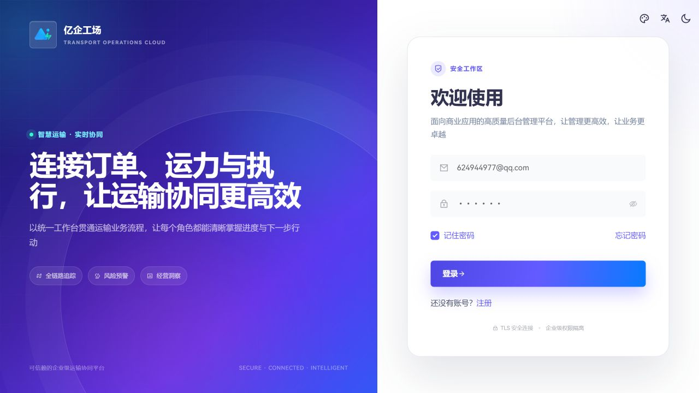
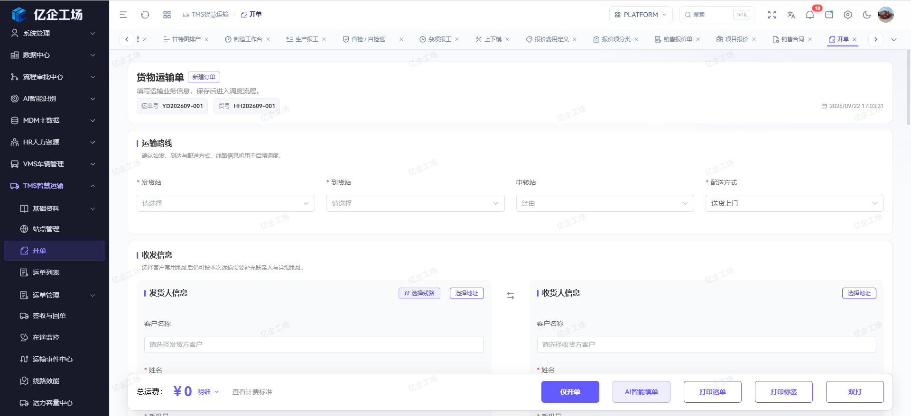
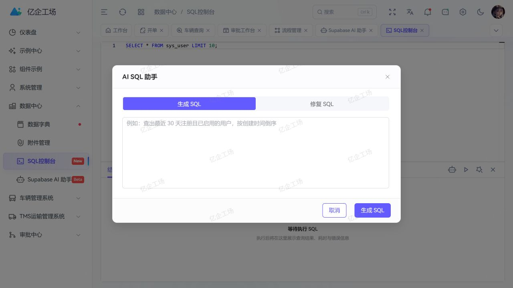

<div align="center">
  
  <h1>Art Supabase Pro</h1>
  <p><strong>Vue 3 + Supabase 驱动的企业级业务中台</strong></p>
  <p>把权限、数据、审批、运输、车辆、财务与 AI 能力真正串成可运行的业务闭环。</p>

  <p>
    <a href="https://gitee.com/wangyanghub/art-supabase-pro">Gitee</a>
    ·
    <a href="https://github.com/869123771/art-supabase-pro">GitHub</a>
    ·
    <a href="https://869123771.github.io/art-supabase-pro/">在线演示</a>
    ·
    <a href="./README.en.md">English</a>
  </p>

  <p>
    
    
    
    
    
  </p>
</div>


## 项目定位

Art Supabase Pro 不是只展示表格、表单和图表的 UI 模板。它以 **Supabase Auth、PostgreSQL、RLS、Storage、Realtime、RPC 与 Edge Functions** 为后端基础，在 Vue 3 管理端中提供可以继续落地和二次开发的企业业务能力。

项目当前已经覆盖：

- 企业级基础平台：登录认证、多租户、RBAC、动态菜单、按钮权限、数据字典、附件、系统参数与审计。
- TMS 运输全链路：客户、承运商、司机、货物、合同、站点、开单、订单、运单、配载、配送、在途监控与财务结算。
- 车辆全生命周期：车辆档案、入档审核、保险、年检、维修、事故、里程、例检、配件与到期提醒。
- 审批工作流：版本化流程、条件节点、任务处理、转交、委托、催办、监控、回调补偿与完整审计轨迹。
- AI 业务能力：智能填单、SQL 助手、项目助手、调度推荐、运输异常研判、费用审核、利润诊断、回款风险、车辆健康、票据/OCR 与质量运营。

## 为什么值得关注

| 能力              | 项目提供的实现                                                               |
| ----------------- | ---------------------------------------------------------------------------- |
| Supabase 原生后端 | Auth、PostgreSQL、RLS、Storage、Realtime、RPC、Edge Functions 深度集成       |
| 多租户与权限      | 租户级数据隔离、角色菜单、按钮权限、平台超级管理员边界                       |
| 真实业务闭环      | 从运输开单、调度、在途、签收，到对账、收付款、发票、利润分析                 |
| 可治理的 AI       | 普通用户可用的只读安全能力、受控写入、运行审计、Token/延迟/失败与反馈闭环    |
| 可复用审批引擎    | 版本不可变、条件路由、审批任务、委托转交、SLA、通知、回调与补偿              |
| 工程化前端        | Vue 3、TypeScript、Vite、Pinia、Element Plus、Monaco、ECharts 与统一业务组件 |

## 核心功能实拍

以下截图均来自当前项目的真实运行环境，而非设计稿。

### AI 智能填单

支持粘贴客户聊天、运输委托等文字资料，也可以上传订单图片。AI 完成识别、字段核对、主数据匹配与建档建议，最终由操作人员确认后回填订单，避免 AI 越权直接保存业务数据。


### TMS 实时在途监控

在同一驾驶舱内查看在途车辆、运输进度、线路、实时报警、司机与货物信息，并提供 AI 异常研判和快捷处置入口。


### 一车一档与车辆健康

围绕单车聚合档案、司机、零部件、保险、年检、违章、事故、维修保养、例检、里程和设备信息，并提供 AI 车辆健康研判。


### 审批工作台与流程治理

审批中心统一承载待办、已处理、我发起、离岗委托和租户隔离；流程定义采用版本化治理，已发布版本保持不可变，可查看节点快照与版本差异。


### Supabase AI 项目助手

统一浏览 Database、视图、函数、触发器、RLS 与 Edge Functions。项目助手基于实时元数据提供只读分析与治理建议，不直接执行 SQL 或修改项目。


### 运输财务工作台

集中展示应收、应付、回款、付款、开票、费用审核、核销进度和运输毛利，并提供 AI 回款风险研判。


### AI 运行与质量运营

对 AI 调用次数、成功率、响应耗时、Token 消耗、能力分布、OCR/填单质量、用户反馈和失败原因进行统一观测，让 AI 能力可追踪、可评价、可持续改进。


<details>
<summary><strong>查看更多：登录体验、运输开单与 AI SQL 工作台</strong></summary>

### 企业级登录体验



### 运输开单工作区



### AI SQL 工作台



</details>

## 业务模块

### TMS 运输管理

- 基础资料：客户、客户地址、客户价格、承运商、承运商价格、司机、货物、合同、站点。
- 运输执行：智能开单、订单列表、待配载、已配载、配送签收、回单识别、异常工单、在途监控。
- 财务结算：客户对账、承运商对账、收付款、核销、发票、运单费用、利润分析。
- AI 辅助：填单、调度、异常研判、费用审核、利润诊断、回款风险、承运商评估、发票与凭证识别。

### 车辆管理

- 车辆档案录入、编辑、审核和详情聚合。
- 保险、年检、违章、事故、维修保养、例检和里程记录。
- 零部件、分类、供应商、领用与寿命跟踪。
- 保险、年检、保养、配件与车辆寿命提醒，支持风险工单与健康研判。

### 审批中心

- 跨业务审批工作台：待我审批、我已处理、我发起的。
- 流程定义、草稿与发布版本、条件节点、会签/或签、SLA 与版本差异。
- 审批、驳回、撤回、转交、委托、催办和完整操作轨迹。
- 业务回调 Outbox、失败重试、死信与人工补偿。

### 数据与 AI

- Monaco SQL 工作台：PostgreSQL 编辑、格式化、补全、JOIN 推断、错误定位与结果查看。
- AI 生成 SQL 与错误修复，结合项目 Schema 摘要减少表名、字段名幻觉。
- Supabase 项目对象浏览和只读项目助手。
- AI 配置、提示词、运行记录、质量指标、用户反馈与问题闭环。

## 技术架构

```text
Vue 3 + TypeScript + Element Plus
              │
       统一 API Provider 层
              │
┌─────────────┴────────────────────────────────────┐
│ Supabase Auth │ PostgreSQL + RLS │ Storage       │
│ Realtime      │ RPC / Functions  │ Edge Functions│
└─────────────┬────────────────────────────────────┘
              │
    TMS / 车辆 / 审批 / 财务 / AI 业务模块
```

## 技术栈

| 分类        | 技术                                                               |
| ----------- | ------------------------------------------------------------------ |
| 前端框架    | Vue 3、TypeScript、Vite、Vue Router、Pinia                         |
| UI 与可视化 | Element Plus、SCSS、Tailwind CSS、ECharts、Vue Flow                |
| 数据与后端  | Supabase、PostgreSQL、RLS、Realtime、Storage、Edge Functions       |
| 编辑与文件  | Monaco Editor、WangEditor、XLSX、File Viewer、XGPlayer             |
| 工程质量    | ESLint、Prettier、Stylelint、vue-tsc、Playwright、Node Test Runner |

## 快速开始

### 环境要求

- Node.js `>= 20.19.0`
- pnpm `>= 8.8.0`
- 一个 Supabase 项目

### 1. 获取代码

```bash
git clone https://gitee.com/wangyanghub/art-supabase-pro.git
cd art-supabase-pro
pnpm install
```

### 2. 配置环境变量

在项目根目录配置 `.env` 或 `.env.development`：

```env
VITE_SUPABASE_URL=https://your-project.supabase.co
VITE_SUPABASE_KEY=your-supabase-anon-key

# 使用在途地图时配置
VITE_AMAP_KEY=your-amap-key
VITE_AMAP_SECURITY_JS_CODE=your-amap-security-code
```

> 前端只应使用 Supabase `anon` key。不要把 `service_role` key、AI Provider 密钥或其他服务端凭证放进 Vite 环境变量；权限安全必须由 RLS、数据库函数和 Edge Functions 在服务端边界保证。

### 3. 启动开发环境

```bash
pnpm dev
```

### 4. 质量检查与构建

```bash
pnpm check
pnpm build
```

常用命令：

| 命令                 | 说明                                    |
| -------------------- | --------------------------------------- |
| `pnpm dev`           | 启动开发服务器                          |
| `pnpm check`         | 运行 UI 审计、类型检查、Lint 与单元测试 |
| `pnpm test:e2e`      | 运行 Playwright 端到端测试              |
| `pnpm build`         | 构建生产版本                            |
| `pnpm build:analyze` | 生成构建体积分析                        |

## 项目结构

```text
art-supabase-pro/
├─ src/
│  ├─ api/                         # 统一 API 与 Supabase Provider
│  ├─ components/core/             # 表格、表单、弹窗、抽屉、选择器等核心组件
│  ├─ hooks/                       # 通用组合式能力
│  ├─ store/                       # Pinia 状态管理
│  ├─ views/
│  │  ├─ dashboard/                # 运营工作台与 AI 运行中心
│  │  ├─ data-center/              # 数据字典、附件、SQL 与 Supabase AI
│  │  ├─ system/                   # 用户、角色、菜单、租户、参数、AI 配置
│  │  ├─ tms-transportation/       # TMS 运输与财务结算
│  │  ├─ vehicle-manage-system/    # 车辆全生命周期管理
│  │  └─ workflow/                 # 审批工作台、流程设计与监控
│  └─ utils/                       # 通用工具
├─ supabase/
│  ├─ functions/                   # Edge Functions
│  ├─ migrations/                  # 数据库迁移、RLS、函数与种子数据
│  └─ tests/                       # 数据库测试
├─ tests/                          # 单元与 E2E 测试
└─ screenshort/                    # README 产品截图
```

## 安全与权限原则

- 所有业务数据按租户隔离，数据库层启用 RLS。
- 普通用户可以使用已启用的 AI 能力，但仅允许租户范围内、业务数据安全的只读操作。
- 业务数据修改、配置、发布、流程状态变更与受控写入必须同时经过 UI 和服务端权限校验。
- AI 历史、运行日志、生成物与反馈可作为审计数据保存，不得绕过业务写权限。

## 开源与贡献

项目采用 [木兰宽松许可证第 2 版（MulanPSL-2.0）](LICENSE) 开源。欢迎提交 Issue、Pull Request，也欢迎分享你的 Supabase、TMS、车辆管理和 AI 业务实践。

本项目基于优秀的 [Art Design Pro](https://gitee.com/lingchen163/art-design-pro) 继续演进，感谢原项目及其社区。
